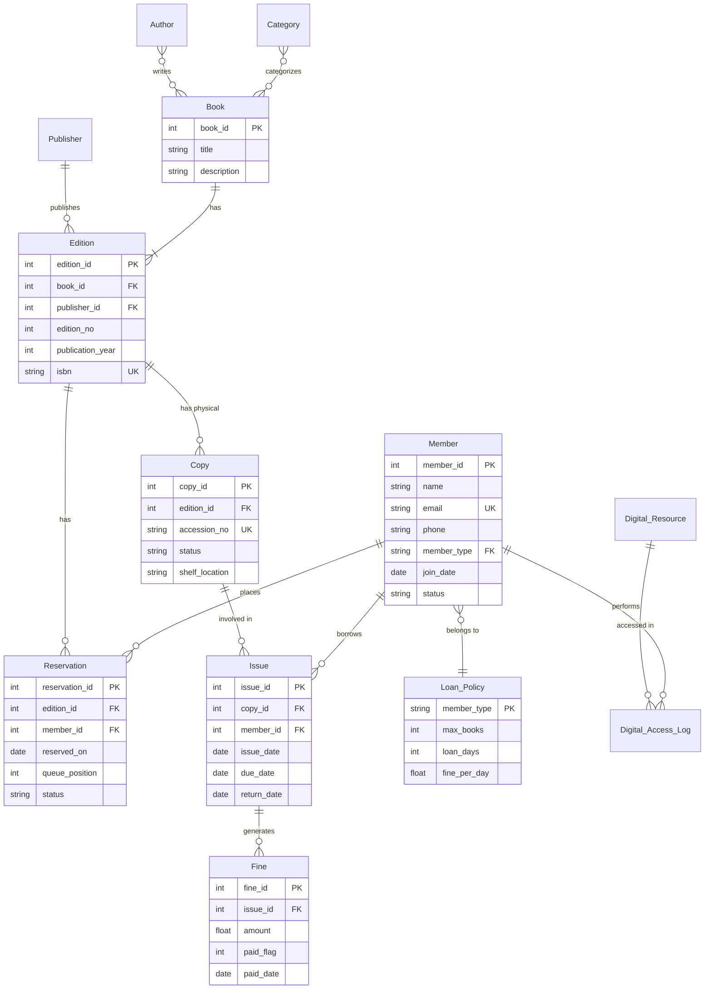

# Entity Relationship Diagram

```mermaid
erDiagram
    Publisher ||--o{ Edition : "publishes"
    Author }o--o{ Book : "writes"
    Category }o--o{ Book : "categorizes"
    Book ||--|{ Edition : "has"
    Edition ||--o{ Copy : "has physical"
    Edition ||--o{ Reservation : "has"
    
    Copy ||--o{ Issue : "involved in"
    Member ||--o{ Issue : "borrows"
    Member ||--o{ Reservation : "places"
    Member }o--|| Loan_Policy : "belongs to"
    
    Issue ||--o{ Fine : "generates"
    
    Digital_Resource ||--o{ Digital_Access_Log : "accessed in"
    Member ||--o{ Digital_Access_Log : "performs"

    Member {
        int member_id PK
        string name
        string email UK
        string phone
        string member_type FK
        date join_date
        string status
    }
    
    Loan_Policy {
        string member_type PK
        int max_books
        int loan_days
        float fine_per_day
    }

    Book {
        int book_id PK
        string title
        string description
    }
    
    Edition {
        int edition_id PK
        int book_id FK
        int publisher_id FK
        int edition_no
        int publication_year
        string isbn UK
    }
    
    Copy {
        int copy_id PK
        int edition_id FK
        string accession_no UK
        string status
        string shelf_location
    }
    
    Issue {
        int issue_id PK
        int copy_id FK
        int member_id FK
        date issue_date
        date due_date
        date return_date
    }
    
    Reservation {
        int reservation_id PK
        int edition_id FK
        int member_id FK
        date reserved_on
        int queue_position
        string status
    }
    
    Fine {
        int fine_id PK
        int issue_id FK
        float amount
        int paid_flag
        date paid_date
    }
```
